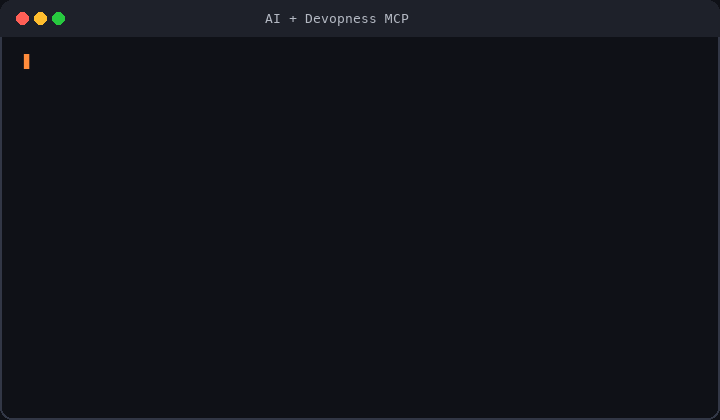

# Devopness: deploy apps and manage servers on your own cloud

**Stop managing DevOps. Ship more, stress less.**

Deploy apps and **provision cloud infrastructure from scratch** in your own accounts (AWS, Azure, GCP, DigitalOcean, Hetzner): networks, subnets, static IPs, servers, Linux configuration, and deploys. One platform instead of Terraform, Jenkins, PaaS (Vercel, Heroku, etc), and server and app management panels.

**One MCP server** for Cursor, VS Code, and other AI agents: manage any cloud, any infrastructure, any Linux version, and any stack (C#, Docker, Go, HTML, Java, Node.js, PHP, Python, Ruby, TypeScript, and more).

## For AI agents (MCP)

Ask your AI agent to provision servers, deploy apps, migrate between clouds, and manage infrastructure. Devopness executes through a secure MCP server.

**One-click install**

Example prompt:

> Migrate my app from AWS to Hetzner.

> When you start the MCP server, you will be asked to **log in with your Devopness account** to authenticate.

**Other supported tools:** Claude Code, Codex CLI, Gemini CLI, Windsurf, Zed, Warp, JetBrains AI, and more. See step-by-step guides in [MCP docs](https://www.devopness.com/docs/mcp/).

## Provision from scratch, not just connect a server

Many self-hosted deploy tools (Coolify, Dokploy, and similar) assume you already provisioned a server and can connect over SSH.

Devopness provisions infrastructure in your cloud from scratch, configures Linux, and deploys your apps. Routine work runs from the web app, API, or MCP: no SSH and no cloud console for everyday tasks.

## What Devopness replaces

Devopness combines what teams usually split across multiple tools into one platform:

**Cloud infrastructure from scratch**

- Networks, subnets, static IPs, servers, and Linux configuration in your cloud accounts (instead of Terraform, Ansible, and manual cloud console work)

**CI/CD and hosted PaaS**

- Deploy pipelines and hosted platforms (instead of Jenkins, GitHub Actions, GitLab CI, Vercel, Heroku, Netlify, Railway, Render, and similar PaaS)

**Server and app management panels**

Instead of separate panels per stack, use one platform for all stacks. Devopness replaces:

- **PHP:** cPanel, Laravel Forge/Envoyer, Plesk, RunCloud, [ServerPanel.app](https://serverpanel.app/)
- **Python:** FastAPI Cloud, and similar stack-focused tools
- **Ruby:** Cloud 66, Hatchbox, Kamal (popular in Rails, works for any stack)
- **Self-hosted (bring your own server):** Coolify, Dokploy

**One workflow everywhere**

- One simpler workflow for any tech stack and any cloud provider, in accounts you control

## What you get

- Ship your apps to infrastructure you own, with more frequent and safer deploys
- Trigger zero-downtime deploys automatically when you push to git
- See deploy history and infrastructure changes in one place, even from mobile, without SSH or cloud console access
- Provision networks, subnets, static IPs, and servers in your cloud, then configure Linux and deploy apps without SSH for routine tasks
- Fine-grained, role-based permissions per environment so teammates deploy without direct cloud-console access
- Run DevOps operations in natural language through MCP when connected to your AI agents

## Quick start

1. **[Create an account](https://app.devopness.com/)**: free, no credit card required
2. **[Follow Getting Started](https://www.devopness.com/docs/)**: workspace → project → environment → first deploy
3. **[Connect MCP](https://www.devopness.com/docs/mcp/)**: optional; one-click in Cursor or VS Code above

## Who this is for

- Developers who ship apps, side projects, and cloud infrastructure
- Team leads who want to simplify deploy workflows, speed up releases, and cut down on complex tooling
- Founders and solo builders deploying from day one on cloud infrastructure they control
- Freelancers and agencies who need fast deploys and separate client infrastructure at an affordable cost

## This repository

Open source packages and documentation for [Devopness](https://www.devopness.com/):

| Path                                                   | Package               | Description                                                                                                                                       |
| :----------------------------------------------------- | :-------------------- | :------------------------------------------------------------------------------------------------------------------------------------------------ |
| [/docs](docs/)                                         | Documentation         | Product docs (published at [devopness.com/docs](https://www.devopness.com/docs/))                                                                 |
| [/packages/sdks/javascript](packages/sdks/javascript/) | `@devopness/sdk-js`   | JavaScript/TypeScript API SDK  |
| [/packages/sdks/python](packages/sdks/python/)         | `devopness`           | Python API SDK                                  |
| [/packages/ui/react](packages/ui/react/)               | `@devopness/ui-react` | React design system        |
| [/examples/applications](examples/applications/)       | Examples              | Sample app integrations (Rails, Express, Laravel, and more)                                                                                       |

## Community

- [Discord](https://devopness.com/discord/)
- [GitHub Discussions](https://github.com/devopness/devopness/discussions)
- [YouTube](https://www.youtube.com/@devopness)

## Contributing

Contributions are welcome. See [CONTRIBUTING.md](CONTRIBUTING.md). If you use AI tools, also read [AGENTS.md](AGENTS.md).

All contributions are subject to the [Code of Conduct](CODE_OF_CONDUCT.md).

Like the project? **[Star this repo](https://github.com/devopness/devopness/stargazers)**: it helps others discover Devopness.

## Changelog

Release notes: [GitHub Releases](https://github.com/devopness/devopness/releases)

## License

[MIT License](LICENSE) unless otherwise specified in a package `LICENSE` file.
