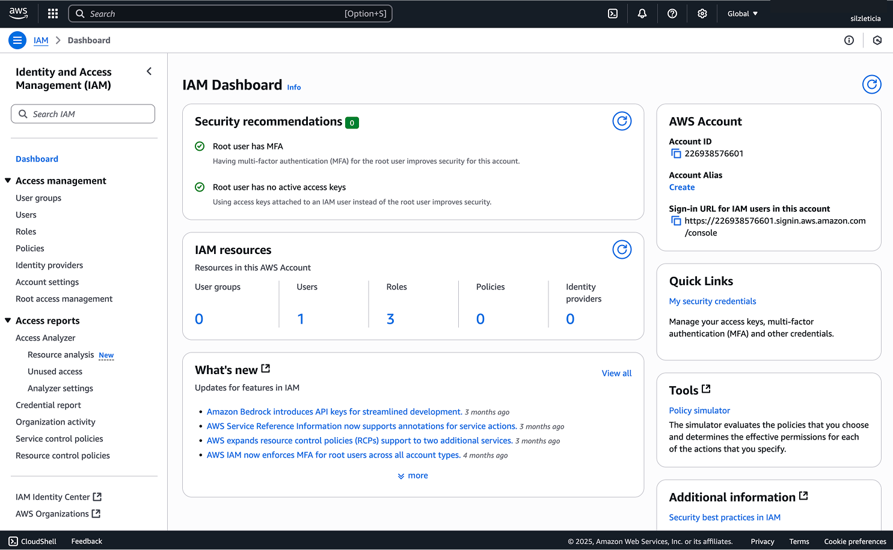
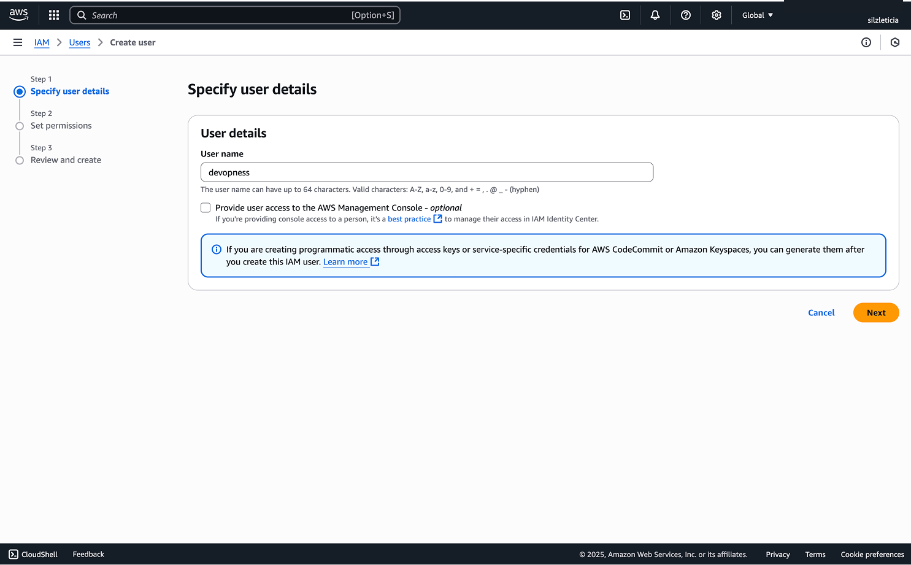
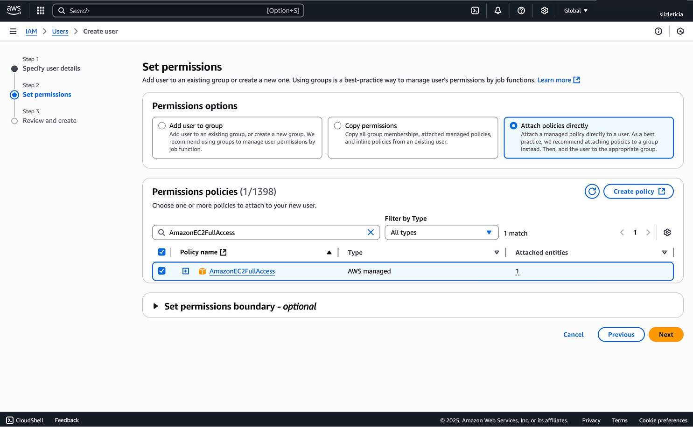
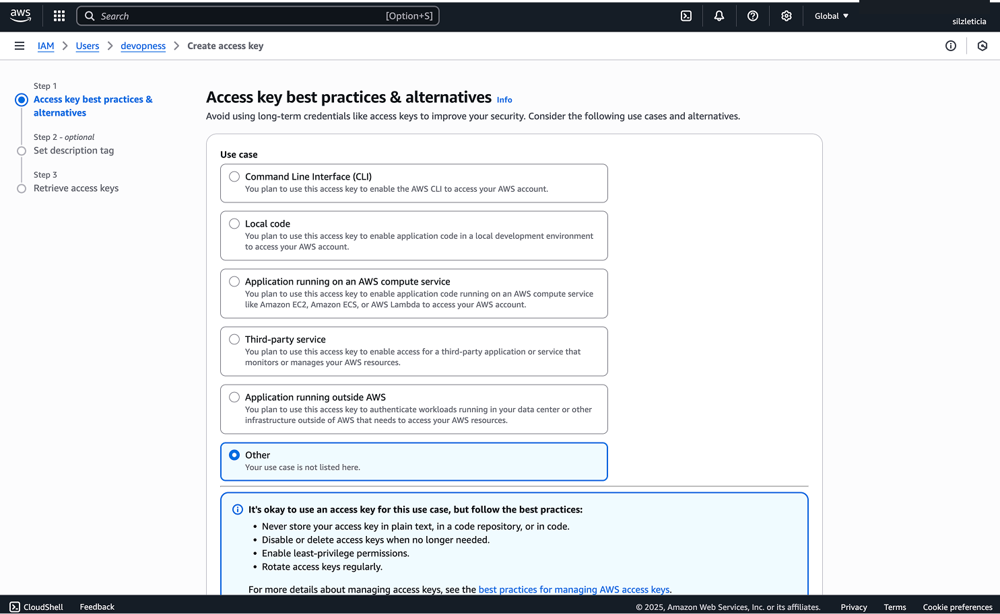

> If you don't have access to an AWS account, you can create an account for free following the cloud-provider-specific guide [AWS Free Tier](https://aws.amazon.com/free/)

1. Log in to the AWS console and access [AWS IAM](https://console.aws.amazon.com/iam/)

1. In the navigation pane on the left side, choose `Users` and then choose `Create user`

1. Type the user name for the new user and click `Next`. Tip: you might want to name the user as `devopness` to make it easier to track its activities

1. In the `Set Permissions` step, click `Attach policies directly`

1. Search and select the policies `AmazonEC2FullAccess`

1. Select `IAMReadOnlyAccess`

1. Follow the prompts then click `Create user`

1. In the `Users` list, click the username link of the user you've just created

1. Navigate to the `Security credentials` tab

1. On this page, scroll down to the `Access keys` section and click `Create access key`

1. Choose `Other` and click `Next`

1. Give the key a description (optional), click 'Next', then click `Create access key`

1. Copy the values of `Access key ID` and `Secret access key`

1. To add the copied credentials to Devopness, see [/docs/credentials/add-credential]
