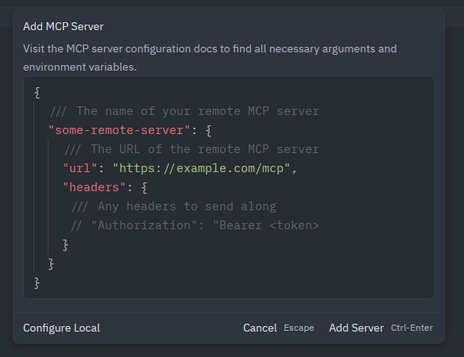
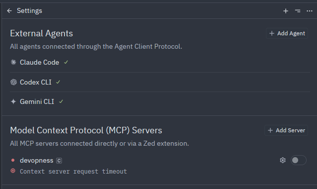
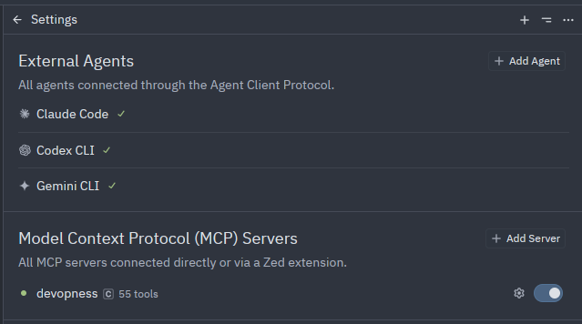

# Installing and Using the Devopness MCP Server in Zed

This guide explains how to configure and use the **Devopness Model Context Protocol (MCP) server** in the Zed editor.

By completing these steps, you allow Zed’s AI features to access **real Devopness context and actions**, such as projects, environments, and applications.

> ⚠️ **Prerequisites**
>
> - Zed installed
> - Node.js and `npx` available
> - A Devopness Personal Access Token (PAT)

---

## 🧠 What is MCP in Zed

Zed uses the **Model Context Protocol (MCP)** to connect to external context servers.

An MCP server:

- Exposes structured data and tools
- Is invoked by a language model (LLM) configured in Zed
- Does **not** act autonomously

Devopness provides an MCP server that exposes your Devopness resources (projects, environments, applications, pipelines) as tools and context that a configured LLM can use inside Zed.

> ℹ️ **Important**
> Devopness is **not an agent** in Zed.
> It is an MCP server whose tools are used by a language model configured in the editor.

---

## ⚙️ Prerequisites

Ensure the following are installed and available before continuing.

### ✔️ Zed editor

Install or update Zed from:
[https://zed.dev](https://zed.dev)

### ✔️ Node.js and `npx`

Zed uses `npx` to run the remote MCP client.

Verify installation:

```bash
node --version
npx --version
```

If not installed, download from:
[https://nodejs.org](https://nodejs.org)

### ✔️ Devopness Personal Access Token

Generate a **Personal Access Token (PAT)** from your Devopness account.
This token authenticates the MCP connection.

---

## 🛠️ Configuring the Devopness MCP Server

In Zed, **configuration** and **activation** are separate steps.

You must configure the MCP server first, then activate it.

---

### Step 1 — Configure the MCP server

Choose **one** of the following methods.

---

#### Option A — Edit the Zed configuration file

1. Open Zed
2. Open **Settings**
   - macOS: `Cmd + ,`
   - Linux / Windows: `Ctrl + ,`

3. Navigate to **AI → Context Servers**
4. Click **Edit in settings.json**
5. Add the following block:

```json
{
  "context_servers": {
    "devopness": {
      "command": "npx",
      "args": [
        "-y",
        "mcp-remote",
        "https://mcp.devopness.com/mcp/",
        "--header",
        "Authorization: Bearer ${DEVOPNESS_PERSONAL_ACCESS_TOKEN}"
      ],
      "env": {
        "DEVOPNESS_PERSONAL_ACCESS_TOKEN": "dvpn_your_real_token_here"
      }
    }
  }
}
```


---

#### Option B — Use the Command Palette

1. Press **Ctrl + Shift + P**
2. Run **`agent:add context server`**
   
3. Paste the same JSON configuration shown above
   
4. Save

> 📌 **Options A and B are alternatives.**
> Use **only one** of them.

---

### Step 2 — Activate the Devopness MCP server (required)

After configuration, the MCP server must be enabled.

1. Open the **Agent Panel**
   - Shortcut: **Ctrl + Shift + ?**
   - Or menu: **View → AI Settings**
2. Locate **Model Context Protocol (MCP)**
   
3. Enable **Devopness** using the toggle

> ⚠️ Configuration alone is not enough.
> The MCP server must be explicitly activated.

---

## ✅ Verifying the MCP Connection

After configuration and activation:

1. Open **Ctrl + Shift + ?** or **View → AI Settings**
2. Under **Model Context Protocol**, you should see:
   - `devopness`
   - Status: **active**
   - A list of available tools (for example: _55 tools_)
     

If the server appears but does not respond correctly, verify:

- Your Personal Access Token
- Node.js and `npx` availability
- That a language model is configured in Zed

---

## 🤖 Using Devopness Context in Zed

Once active, the Devopness MCP server provides tools that a configured LLM can use.

Example prompts:

- `List my Devopness projects`
- `Show my Devopness environments`
- `Fetch my Devopness applications`

> ℹ️ If your Devopness account has no resources, empty results are expected.

---

## ⚠️ Common Issues

### No language model configured

An MCP server requires an active LLM (OpenAI, Anthropic, Ollama, etc.).
Configure a language model before testing prompts.

### Generic or fictional responses

This usually means the LLM responded **without invoking the MCP server**.
Ensure:

- Devopness is active under **Model Context Protocol**
- The token is valid

### `npx: command not found`

Install Node.js and ensure `npx` is available in your system PATH.

### Authentication errors

Double-check your Devopness Personal Access Token.

---

## 📌 Summary

- Devopness provides an **MCP server**, not an autonomous agent
- MCP servers must be **configured and activated**
- A language model is required to use MCP tools
- Once active, Devopness context becomes available to Zed’s AI features

This setup enables Zed to interact with **real Devopness data**, improving accuracy and usefulness when working with Devopness-related workflows.
